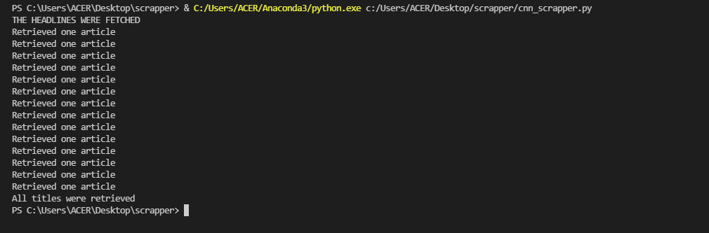
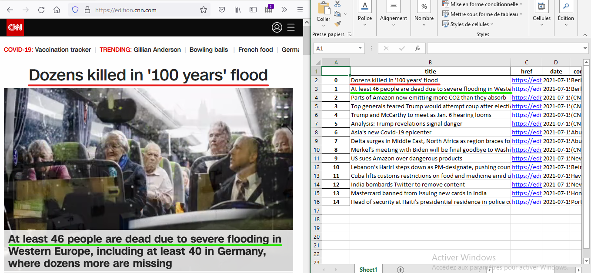
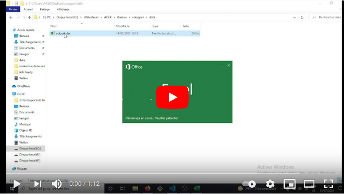

### Date created
This project was created on 2020-12-25.

### Description
This project is a command-line application that extracts news headline's data of [CNN](https://edition.cnn.com/) and puts it in an excel file (.xlsx file). The data includes the title, link, date, and the article's text of the headlines. 

This app uses [Selenium webdriver](https://www.selenium.dev/). It is a tool that takes control of a web browser (Firefox for this project) to access websites programmatically. 

### Files used
- `cnn_scrapper.py` : the file that contains the code for extracting the data.
- `geckodriver.exe` : the driver that Selenium needs to take control of Firefox. You can download it from [here](https://github.com/mozilla/geckodriver/releases). 

Note that you also need to update [Firefox](https://www.mozilla.org/en-US/firefox/new/) to the latest version. 

### Installation

You need to install Selenium using the command below:

`pip install selenium`

You also need to install [Pandas](https://pandas.pydata.org/docs/index.html), a library for data manipulation and analysis. You can either install it with pip :

`pip install pandas`

Or with [Anaconda](https://www.anaconda.com/), a python distribution with a focus on data science. If you’re interested in Anaconda you can follow their [installation guide](https://www.anaconda.com/distribution/).

### Running the app

Before running the app, you need to make sure that `cnn_scrapper.py` and `geckodriver.exe` are in the same folder. After that, run `cnn_scrapper.py` in your terminal:

`python cnn_scrapper.py` 

The program will take around 5 mins to retrieve the headlines and their corresponding articles. You should see something like the image below in your terminal: 

After finishing, the results will be saved in `output.xlsx` in the `data` folder. 

Below is a complete walkthrough of the app:

